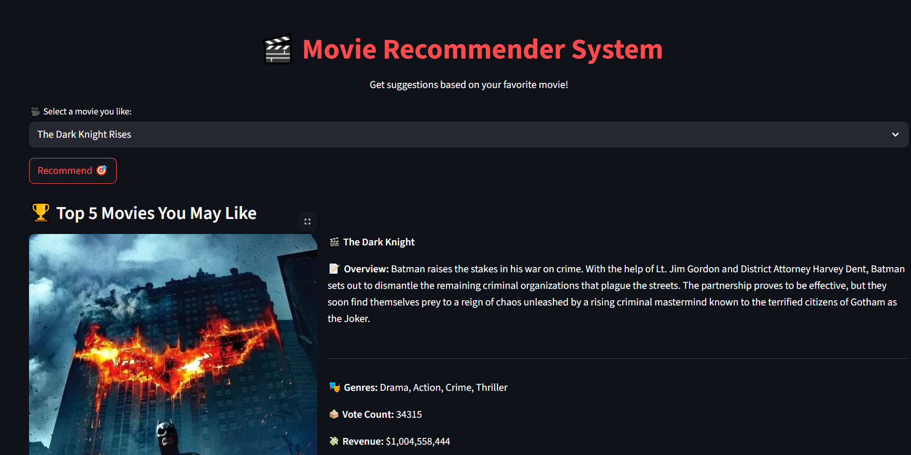

# 🎬 Content-Based Movie Recommendation System

Welcome to your personalized movie recommender! This project uses content-based filtering to suggest similar movies based on textual features like genres, keywords, and overviews. Built with **Streamlit** for an interactive UI and powered by the **TMDB dataset**, it’s a lightweight, modular app that’s easy to deploy and extend.

---

## 🚀 Features

- 🔍 **Search by Movie Title**: Get recommendations based on your favorite film.
- 🧠 **Content-Based Filtering**: Uses Bag-of-Words and cosine similarity to find similar movies.
- 🎨 **Streamlit UI**: Clean, responsive interface with movie posters and metadata.
- 📦 **TMDB Dataset**: Rich metadata including genres, cast, crew, and overviews.
- ⚙️ **Modular Codebase**: Easy to extend with new features like ratings, popularity, or hybrid models.

---

## 🧰 Tech Stack

| Tool         | Purpose                                      |
|--------------|----------------------------------------------|
| Python       | Core logic and data processing               |
| Pandas       | Data manipulation and cleaning               |
| Scikit-learn | Vectorization and similarity computation     |
| Streamlit    | Interactive web UI                           |
| TMDB API     | Movie metadata and poster retrieval          |

---

## 📁 Project Structure

